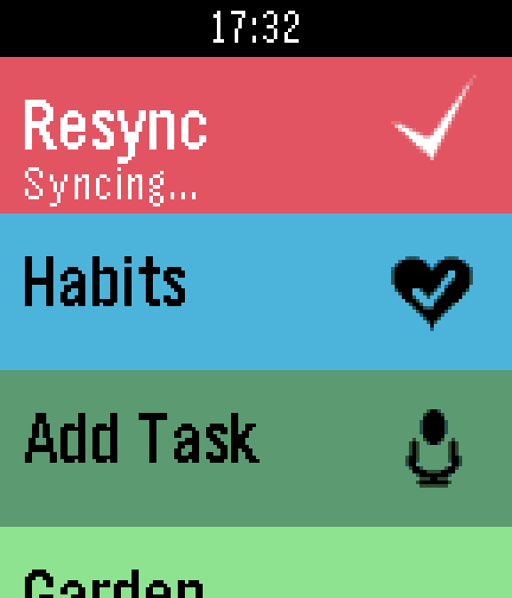
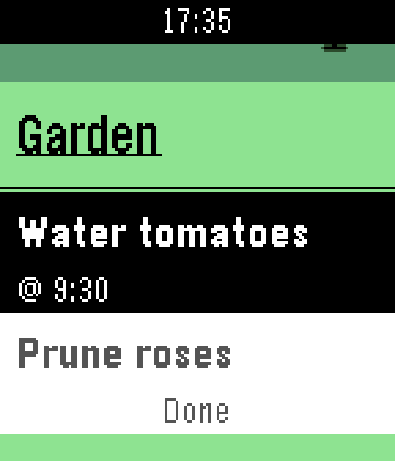
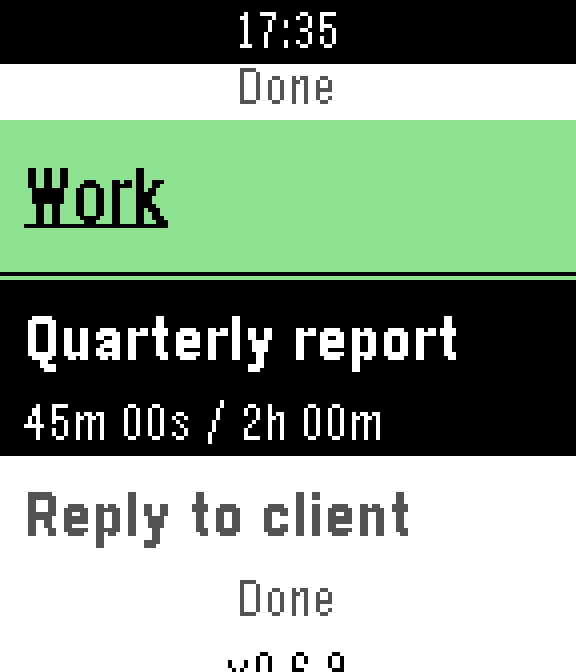
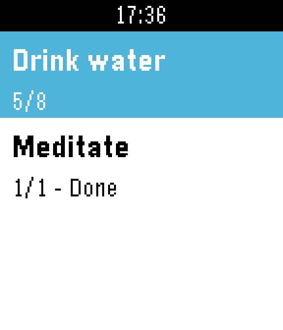

# Pebble Super Productivity

A PebbleOS watchapp that shows your active tasks from [Super
Productivity](https://super-productivity.com) — optionally grouped by
project — and lets you mark them done, track time, dictate new tasks by
voice, and track habits, all from your wrist, synced through Super
Productivity's own **SuperSync** server.

## Screenshots

| | | |
|---|---|---|
|  |  |  |
| Pinned action rows, plus the app version footer | Per-project grouping, done-task dimming, due times | Time tracking (`spent / estimate`) |

| |
|---|
|  |
| Habit tracking (Super Productivity's SimpleCounter feature) — increment/decrement with Select/long-Select |

## Architecture

```
 ┌─────────────┐   AppMessage    ┌──────────────────┐   HTTPS (JSON)   ┌──────────────────┐
 │  Watch (C)  │ ◄──────────────► │ PebbleKit JS      │ ◄───────────────► │ SuperSync server │
 │ src/c/main.c│   over Bluetooth │ src/pkjs/index.js │                   │ (self-hosted or  │
 └─────────────┘                  └──────────────────┘                   │ sync.super-      │
                                                                          │ productivity.com)│
                                                                          └──────────────────┘
```

Pebble hardware has no networking API of its own (no sockets, no HTTP
client, no TLS), so the phone relays: the watch talks AppMessage over
Bluetooth to a PebbleKit JS component running inside the Pebble mobile
app, and that JS component makes the actual HTTPS calls to SuperSync.

### Components

- **`src/c/main.c`** — the watchapp UI. A `MenuLayer` list with a "Resync"
  action row, an optional "Habits" row, an optional "Add Task" (voice
  dictation) row on mic-equipped watches, per-project grouping, done/not-done
  toggling, due-time and time-tracking display, a second `Habits` page, and a
  fullscreen error overlay. The Habits and Add Task rows can each be turned
  off from the phone's pairing settings.
- **`src/pkjs/index.js`** — the sync engine. Downloads and replays
  SuperSync's operation log, decrypts payloads when E2EE is on, pushes the
  active task and habit lists to the watch, and uploads changes made on the
  watch (task completion, time tracking, habit adjustments, new tasks
  dictated via "Add Task").
- **`src/pkjs/lib/supersync-client.js`** — REST client for the SuperSync API
  plus `createCrypto(password)` (Argon2id key derivation + AES-GCM
  encrypt/decrypt).
- **`src/pkjs/lib/task-store.js`** — replays the op log into a local entity
  cache and derives the watch's task and habit lists from it (backlog
  exclusion, project grouping, "today" filtering).
- **`src/pkjs/lib/blake2b.js`, `argon2id.js`** — dependency-free BLAKE2b and
  Argon2id (RFC 9106), since the Pebble JS bundler can't handle `BigInt`
  literals (64-bit words are `[hi, lo]` number pairs instead).
- **`src/pkjs/lib/aes-gcm.js`, `sha256.js`, `base64.js`** — dependency-free
  crypto primitives, since PebbleKit JS doesn't reliably expose
  `window.crypto.subtle`.
- **`src/pkjs/lib/pairing-page.js`** — the phone-side settings/pairing page,
  inlined as a `data:` URI (`config/pairing.html` is a plain-HTML mirror
  kept for reference/local editing).

## Verification

The SuperSync wire format, op-log shape, and crypto wire format were
confirmed against the actual `super-productivity/super-productivity` source
(client, server, and shared packages) and against a real account's live
traffic and decrypted op history — not just inferred from docs. The crypto
primitives are cross-checked against Node's `crypto` module and `hash-wasm`
byte-for-byte (see Testing below). `CLAUDE.md` has the fuller
verified-vs-assumed history for anyone (human or AI) digging into sync
internals.

## Building

```bash
# Rebble's maintained pebble-tool (the original Pebble SDK build servers are gone)
pip install pebble-tool
pebble build
pebble install --phone <phone-ip>   # or --emulator basalt
```

The JS-only logic can be exercised without the SDK, since it's plain
CommonJS:

```bash
node scripts/test-crypto.js
node scripts/test-argon2.js   # includes one ~15s production-parameters case
node scripts/test-task-store.js
```

## Pairing

1. Install the watchapp, open the Pebble mobile app, find "Super
   Productivity" in your watchapps, and tap Settings.
2. Enter your SuperSync server URL, email, and sync encryption password.
   Tap "Open SuperSync login", sign in there, copy the token it displays,
   and paste it into the "SuperSync access token" field. Adjust the display
   settings if you want (group by project, today-only, auto-sync, default
   project for dictated tasks, enable/disable Habits or Add Task). Save.
3. The watch syncs automatically on next launch, or immediately if it's
   already open.

## AppMessage protocol

| Direction | `MSG_TYPE` | Purpose | Extra keys |
|---|---|---|---|
| phone→watch | `TASK_SYNC_START` | begin a task list push | `TASK_TOTAL` |
| phone→watch | `TASK_ITEM` | one task | `TASK_INDEX`, `TASK_ID`, `TASK_TITLE`, `TASK_DONE`, `TASK_PROJECT`, `TASK_DUE_MIN` (omitted if no `dueWithTime`), `TASK_TIME_SPENT_MS` (omitted if no tracked time), `TASK_TIME_ESTIMATE_MS` (omitted if no estimate) |
| phone→watch | `TASK_SYNC_END` | list push finished, redraw | — |
| phone→watch | `SYNC_STATUS` | syncing / ok / not-paired / error | `STATUS_CODE`, `STATUS_MSG`, `HABITS_ENABLED`, `ADD_TASK_ENABLED` (the phone's own feature-toggle settings) |
| watch→phone | `REQUEST_SYNC` | ask phone to sync now | — |
| watch→phone | `TASK_TOGGLE` | user marked a task done/undone | `TASK_ID`, `TASK_DONE` |
| watch→phone | `TRACK_TIME_STOP` | long-select stopped tracking a task | `TASK_ID`, `TRACKED_MS` |
| phone→watch | `HABIT_SYNC_START` | begin a habit list push | `HABIT_TOTAL` |
| phone→watch | `HABIT_ITEM` | one habit | `HABIT_INDEX`, `HABIT_ID`, `HABIT_TITLE`, `HABIT_DONE`, `HABIT_VALUE`, `HABIT_GOAL` |
| phone→watch | `HABIT_SYNC_END` | habit list push finished, redraw | — |
| watch→phone | `HABIT_ADJUST` | Select/long-select bumped today's count | `HABIT_ID`, `HABIT_DELTA` |
| watch→phone | `TASK_ADD` | dictated a new task via "Add Task" | `TASK_TITLE` |

## Known limitations

- **Only a subset of Super Productivity actions round-trip.** Task
  completion, scheduling, backlog moves, project moves, subtask
  promotion/demotion, time tracking, and habit adjustments are handled;
  anything else (deadlines, tags, etc.) is a no-op on replay rather than a
  crash. See `task-store.js`'s `applyTaskAction` for the full handled list.
- **No offline retry queue.** If uploading a change fails (phone offline,
  server error), it's logged and left for the next full sync to reconcile.
- **No delete from the watch.** Task/habit creation (via "Add Task" voice
  dictation) and completion round-trip; deleting an existing task or habit
  still requires the desktop/mobile app.
- **Conflict resolution** relies entirely on SuperSync's own operation-log
  ordering; this client doesn't do any additional merging.
- Subtasks are never selected independently — they ride along with their
  parent task, indented with a `~` prefix.
