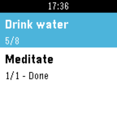
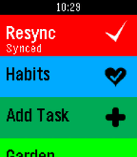

# Pebble Super Productivity

A PebbleOS watchapp that shows your active tasks from
[Super Productivity](https://super-productivity.com), optionally grouped by
project, and lets you mark them done, track time, dictate new tasks by voice, and
track habits — synced through Super Productivity's own **SuperSync** server.

| | | |
|---|---|---|
|  |  |  |
|  |  |  |

Shown at Pebble Time 2 size. The same shots sized for other platforms:
[`pebble-time-2`](screenshots/pebble-time-2) (200×228),
[`pebble-round`](screenshots/pebble-round) (180×180, chalk),
[`pebble-time`](screenshots/pebble-time) and
[`pebble-2`](screenshots/pebble-2) (144×168).

## Controls

- **Up / Down** — scroll the list
- **Select** — toggle a task done; on an action row, activate it
- **Long-press Select** — start/stop time tracking; append a note on the notes
  screen; increment a habit
- **Double-click Select** — show a task's or project's notes and tags
- **Back** — previous screen

Time-2 touch navigation (swipe to scroll, tap a row, swipe right to go back) is
experimental and off by default — enable "Touch navigation" in settings.

## Pairing

1. Install the watchapp, open the Pebble app, find "Super Productivity" in your
   watchapps, tap Settings.
2. Enter your SuperSync server URL, email, and sync encryption password. Tap
   "Open SuperSync login", sign in, copy the token, and paste it into "SuperSync
   access token". Adjust the display settings, then Save.
3. The watch syncs on next launch.

## Limitations

- **Initial sync is slow** — the first decrypt can take 5+ minutes.
- **Add Task** needs a Pebble with a mic and an internet connection (dictation
  runs in the cloud).
- **Only some actions round-trip** — completion, scheduling, backlog/project
  moves, subtask promote/demote, time tracking, habits. Anything else (deadlines,
  tags) is a no-op on replay.
- **No offline queue** — a failed upload waits for the next full sync.
- **No delete from the watch** — creation and completion round-trip; deleting a
  task or habit still needs the desktop/mobile app.
- **`aplite` (original Pebble / Steel)** is RAM-limited: Finish Day, StopWatch
  habits, the over-estimate notification, and pin-tracked-task are unavailable.

## Downloads & changelog

`.pbw` artifacts and full release notes:
[Releases](https://github.com/BigWebstas/PebbleSuperProductivity/releases).
